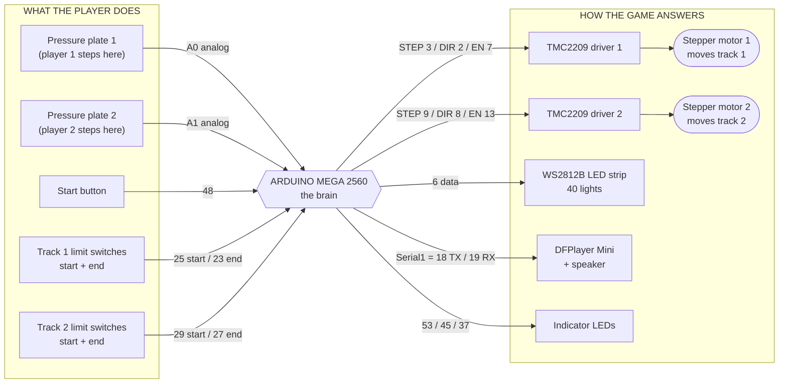
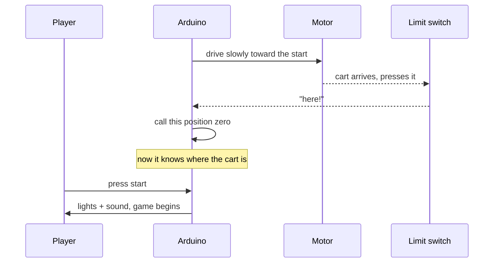

# The wiring, as a picture

This is the whole machine on one page. **You do not need to know electronics to
read it** — every box is a physical part you can hold, and every arrow is a wire.

The numbers on the arrows are the pin numbers on the Arduino. They match
[`firmware/carnival/src/config/pins.h`](../../firmware/carnival/src/config/pins.h)
exactly. If they ever disagree, `pins.h` is right and this page is stale — say
something.

---

## The whole thing

Arrows point the way information travels. Things on the left tell the Arduino
what the player did; things on the right are how the game answers.

---

## What each part actually does

### The pressure plates — the important bit

Two sheets with a thin gap and a pressure-sensitive material (**Velostat**)
between them. Standing on it squeezes the sheets together and its **resistance
drops**.

That is why they are on **A0 and A1**, the *analog* pins. A normal pin only
answers "is it on or off." An analog pin answers "how hard," on a scale of 0 to
1023 — and how hard is exactly what we need, because the whole project exists to
be playable by children who cannot stamp.

The firmware calls it a press when the reading drops below `PRESSURE_THRESHOLD`
and stays there for 250 ms. The 250 ms is deliberate: it ignores a foot brushing
past, without demanding a stomp.

> ⚠ **Re-measure the threshold whenever the plate material changes.** TPU and PLA
> do not read the same numbers. The old value is not transferable.

### The limit switches — how the cart knows where it is

A stepper motor can count its own steps, but it has no idea where it *started*.
So each track has two little switches, one at each end. On power-up the cart
drives until it bumps one, and that becomes position zero.

They are wired `INPUT_PULLUP`, which is a way of saying the Arduino holds the
wire high by itself and the switch's job is just to yank it to ground. It saves a
resistor per switch.

> From the V1 build log: the switch must be struck by the **cart platform, not
> the wheels**. Getting that wrong cost an afternoon and a reprint.

### The steppers and their drivers

The Arduino does not drive the motors directly — it hasn't the muscle. It sends
three small signals to a **TMC2209 driver**, which does the actual pushing:

| Signal | Meaning |
|---|---|
| `STEP` | one pulse = one step |
| `DIR` | high or low = forwards or backwards |
| `ENABLE` | **LOW turns the motor on** (backwards from what you'd guess) |

### The lights and the sound

The **WS2812B strip** is 40 LEDs on a single data wire — each light listens for
its turn in the message, which is why one pin can control all forty.

The **DFPlayer Mini** is a small MP3 player with an SD card. The Arduino tells it
"play track 9" and it does the rest. Track numbers are the filenames on the card:
`0009.mp3` is track 9. The list lives in
[`audio.h`](../../firmware/carnival/src/hardware/audio.h).

It talks over `Serial1` — a second serial port. This is the reason the project
needs a **Mega** and not a Uno: a Uno has exactly one serial port and the USB
cable is already using it.

---

## ⚠ One known defect: pin 13

`ENABLE` for driver 2 is on **pin 13**, which is also the Mega's built-in LED
pin.

Every time the board resets or you upload code, the bootloader blinks that LED
for about a second. Because enable is active-LOW, driver 2 sees that blink as
**"turn on, turn off, turn on"** — so motor 2 twitches at every power-up and
every flash.

This came from V1 and is documented here as the machine truly is. Fixing it
means physically moving one wire to any free digital pin that isn't 13, and
editing `pins.h` in the same pull request. Harmless while bench testing, worth
fixing before V2 is delivered.

---

## The startup sequence

---

## If you change the wiring

1. Move the wire.
2. Edit `pins.h`.
3. Edit the table in [`docs/HARDWARE.md`](../../docs/HARDWARE.md).
4. Edit the diagram above.
5. Put all of it in **one** pull request.

Four places sounds like a lot. It is the difference between the next person
trusting this page and the next person losing an afternoon to a fault that was
never there.

**Photographs of the real wiring are worth as much as any diagram — take them and
add them to this folder.**
